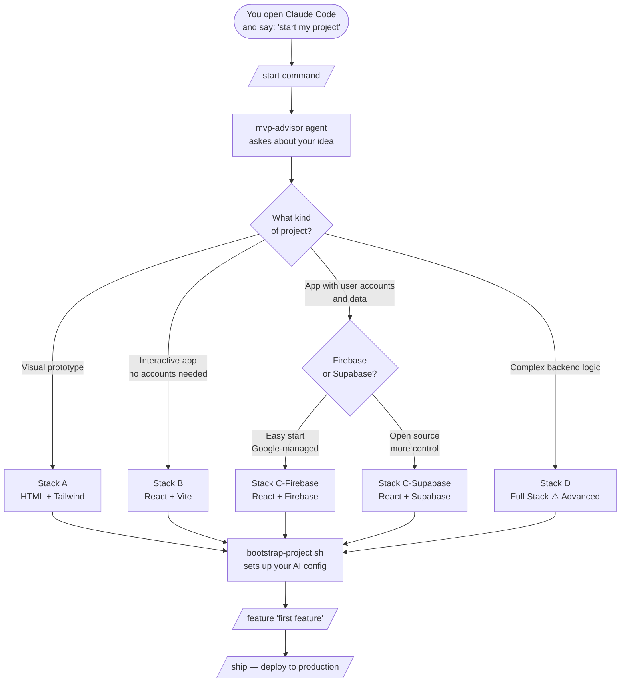

# founder-stack

**A Claude Code configuration kit for non-technical founders who want to vibe-code their MVP.**

No dev experience required. You bring the idea — the AI agents handle the technical decisions, guide you through every step, and help you ship.

---

## What is this?

founder-stack is not a code template. It's an **AI configuration layer** — a set of agents, prompts, and commands that sit on top of [Claude Code](https://claude.ai/code) and turn it into a co-founder who can code.

When you open Claude Code in a founder-stack project, it knows:
- How to ask the right questions to understand your idea
- Which tech stack fits your needs (and why, in plain language)
- How to guide you step by step, from first idea to live product
- When to stop and ask for your confirmation before doing anything risky

---

## Who is it for?

- Founders who want to build an MVP but don't know how to code
- Solo builders who want to move fast without hiring a dev team
- Anyone who wants to "vibe-code" a product idea into reality

---

## How it works



---

## The 5 stacks

| Stack | Best for | Deploy to |
|-------|----------|-----------|
| **A — HTML prototype** | Showing an idea, zero setup | Netlify Drop (drag & drop) |
| **B — React app** | Interactive app, no accounts | Vercel (free) |
| **C — React + Firebase** | App with accounts & data, fast start | Firebase Hosting |
| **C — React + Supabase** | App with accounts & data, open source | Vercel + Supabase Cloud |
| **D — Full Stack** ⚠️ | Complex business logic, full control | Railway |

Not sure which one? Run `/start` — Claude will ask you 6 simple questions and recommend the right stack.

---

## Quick start

### WSL2 / Linux

```bash
git clone https://github.com/avtplay/founder-stack.git ~/founder-stack
cd ~/founder-stack
bash scripts/setup-wsl.sh
```

This installs: Node 20, pnpm, Claude Code, RTK (token optimizer), SuperClaude, PostgreSQL.

```bash
# Authenticate
claude   # sign in with your Claude.ai account (Pro or Max)

# Create your first project
bash scripts/bootstrap-project.sh my-project --stack b --git
cd ~/projects/my-project
claude
```

### Windows (native)

Open PowerShell as Administrator:

```powershell
git clone https://github.com/avtplay/founder-stack.git $env:USERPROFILE\founder-stack
cd $env:USERPROFILE\founder-stack
Set-ExecutionPolicy Bypass -Scope Process
.\scripts\setup-windows.ps1
```

This installs: Node 20, pnpm, Claude Code, Git, PostgreSQL.

```powershell
# Authenticate
claude   # sign in with your Claude.ai account (Pro or Max)

# Create your first project
.\scripts\bootstrap-project.ps1 my-project -Stack b -Git
cd $env:USERPROFILE\projects\my-project
claude
```

> **Windows note:** RTK (token compression) and SuperClaude (`/sc:` commands) are not available on native Windows. All AI agents, commands, and the full workflow work normally.

Then just tell Claude: **"I want to start my project"** — it takes it from there.

---

## Commands

| Command | What it does |
|---------|-------------|
| `/start` | Full onboarding: idea → stack choice → project setup |
| `/spec "your idea"` | Turn a vague idea into a concrete MVP spec |
| `/feature "description"` | Build a feature, with checkpoints before each step |
| `/ship` | Deploy your project, guided step by step |
| `/review` | Check your code before publishing |
| `/handoff` | Save context before clearing the conversation |

---

## AI Agents

Claude Code automatically delegates to specialized agents when needed:

| Agent | Triggered when |
|-------|---------------|
| `mvp-advisor` | You describe a new idea or want to define your project |
| `security-reviewer` | Working on auth, payments, or sensitive data |
| `db-architect` | Changing the database schema or writing queries |
| `test-writer` | After implementing a feature, before shipping |
| `frontend-specialist` | Building complex UI components |

You don't need to trigger them manually — Claude decides when to use them.

---

## Checkpoints

Agents always stop and wait for your confirmation before:

1. Running database migrations
2. Committing and pushing code
3. Modifying auth or security logic
4. Installing new dependencies
5. Deleting files

Nothing irreversible happens without your explicit approval.

---

## Project structure (after bootstrap)

```
my-project/
├── CLAUDE.md              ← tells Claude how to behave in this project
├── AGENTS.md              ← stack config (rules, commands, constraints)
├── .claude/
│   ├── agents/            ← specialized AI agents
│   ├── commands/          ← slash commands
│   └── settings.json      ← hooks and permissions
└── .env.local             ← your secret keys (never committed)
```

---

## Requirements

- WSL2 (Ubuntu) or Linux
- A [Claude.ai Pro or Max](https://claude.ai) account
- ~10 minutes for the one-time setup

No coding knowledge required.

---

## Token optimization

founder-stack includes [RTK](https://github.com/rtk-ai/rtk) (Rust Token Killer), which compresses CLI output by up to 89% before it reaches Claude. This means your context stays clean longer and your Claude usage goes further.

```bash
rtk gain          # see how many tokens you've saved
ccusage           # daily usage report
cmonitor          # live token monitor
```

---

## License

MIT — free to use, fork, and build on.
